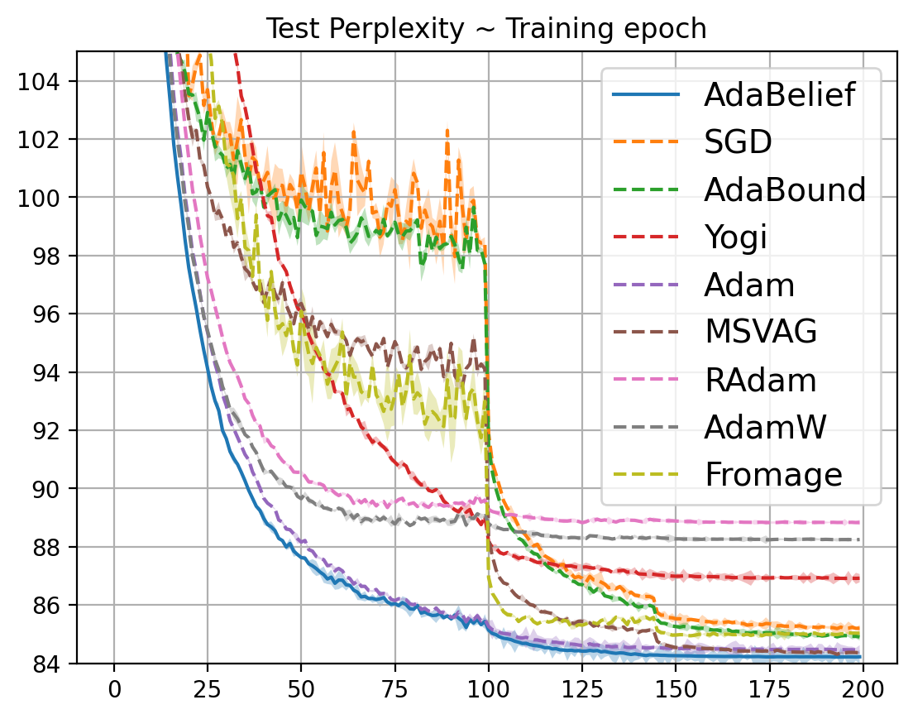
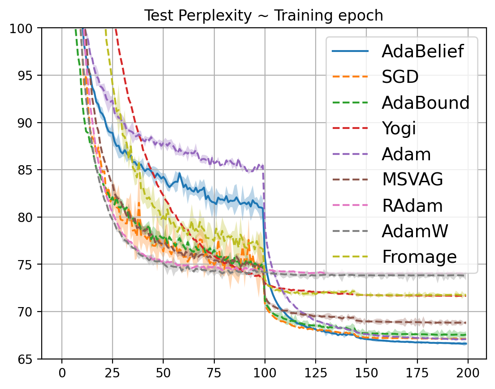
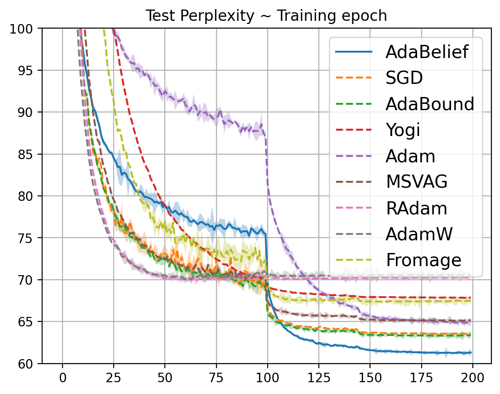

##  Steps to train LSTM on Penn Treebank (PTB) and WikiText-2 

###  Download Dataset
To download the dataset run [getdata.sh](./getdata.sh). Within the data folder you can see subfolders of specific datasets.

### Command to run

#### 1 Layer LSTM

> python run_all_layer1.py

#### 2 Layer LSTM

> python run_all_layer2.py

#### 3 Layer LSTM

> python run_all_layer3.py

- The aforementioned commands will run 1, 2, or 3 layer LSTM models with the specified dataset (check `--data` argument in [main.py](./main.py)) on all the optimizers.
- The hyper-parameters for different optimizers and runtime for the experiments can be looked up from [root README.md](../README.md).

### Visualization results

During training data, points for train and test perplexities are stored in the curve folder. To visualize train or test perplexities v/s epochs refer [./LSTM_test.ipynb](./LSTM_test.ipynb).

### Test perplexities on PTB dataset using LSTM model
#### 1 Layer LSTM  
  
#### 2 Layer LSTM
  
#### 3 Layer LSTM

