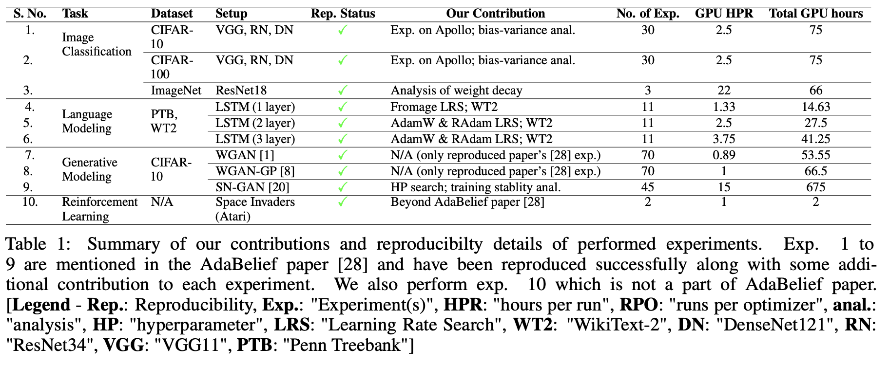
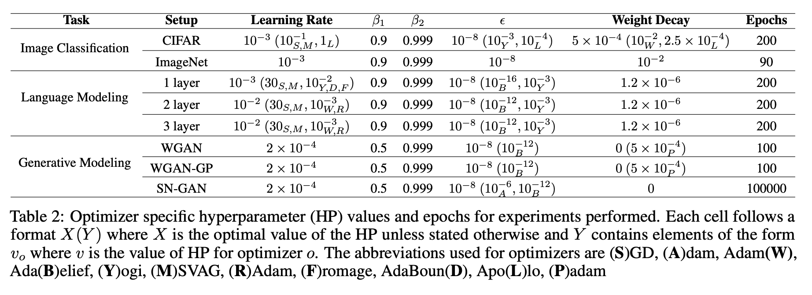

## Reproducibility Challenge (RC2021 spring): AdaBelief Optimizer

This repository contains code for the experiments presented in our reproducibility report for the [AdaBelief paper](https://juntang-zhuang.github.io/adabelief/) as part of [ML Reproducibility Challenge Spring 2021]([https://paperswithcode.com/rc2020](https://paperswithcode.com/rc2020)). The paper was one of the spotlight papers at NeurIPS 2020.

### How to Run
Create a conda environment from `adabelief.yml` as follows:
```
conda env create -f adabelief.yml
```
- To reproduce a particular experiment, please go to relevant subdirectory and follow instructions in the `README.md` present there.
- Unless stated otherwise, activate and use the environment created above for all subdirectories.

### Acknowledgment
We make use of  [official repository](https://github.com/juntang-zhuang/Adabelief-Optimizer), [SN-GAN repository](https://github.com/juntang-zhuang/SNGAN-AdaBelief),  [RL toy repository]( https://github.com/juntang-zhuang/rainbow-adabelief) provided by the author. We would also like to thank the author Juntang Zhuang for his invaluable inputs that helped us in reproducing the experiments.

### Summary of the experiments performed



### Hyperparameter values



