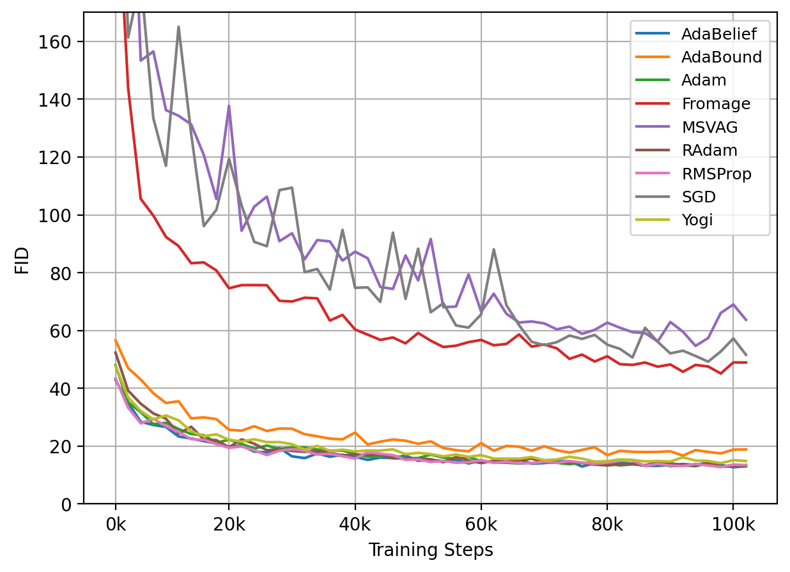

### Steps to train SN-GAN
This folder contains code to train SN-GAN  (Spectral Normalization GANs). 

### Dependencies

Create a conda environment from [environment.yml](./environment.yml) and use it.

### Command to run 

>python main.py -t -e -c configs/CIFAR10/SNGAN-{optimizer}.json

- Replace `{optimizer}` with the optimizer you wish to train with.
- Configurations related to different optimizers can be looked up from [configs](./configs) folder. Data-points generated from training and logs will be present in [logs](./logs) folder.
- To make the plots make use of [fid_SNGAN.py](./fid_SNGAN.py). after installing tensorflow. You could alternatively make use of tensorboard to visualize these plots using `tf.events` files from [logs](./logs) folder.

### FID Plots for SN-GAN training on CIFAR-10

#### FID v/s number of steps

