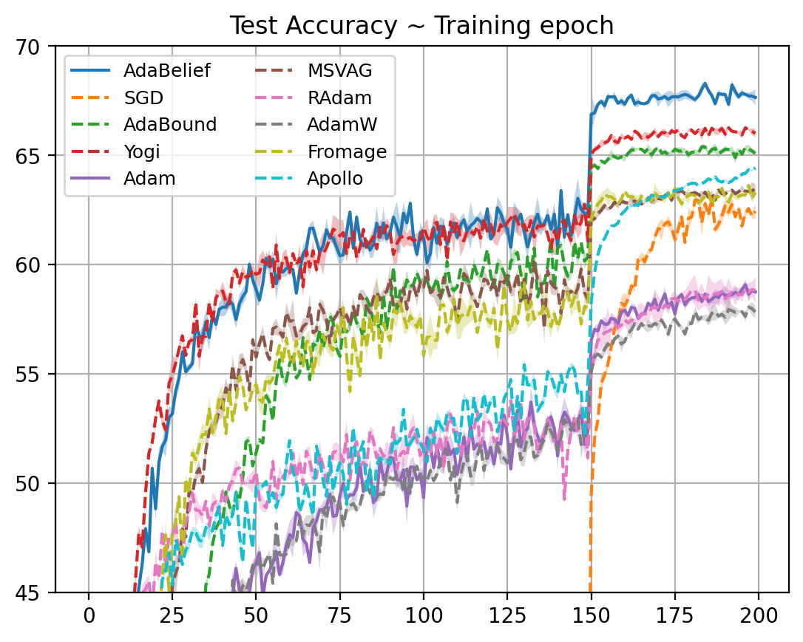
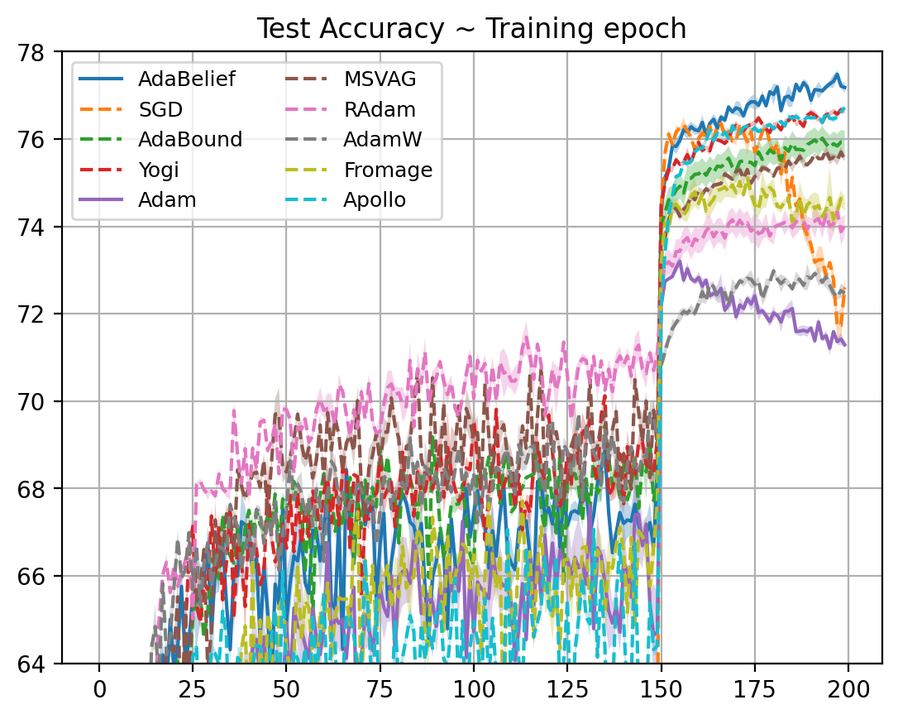
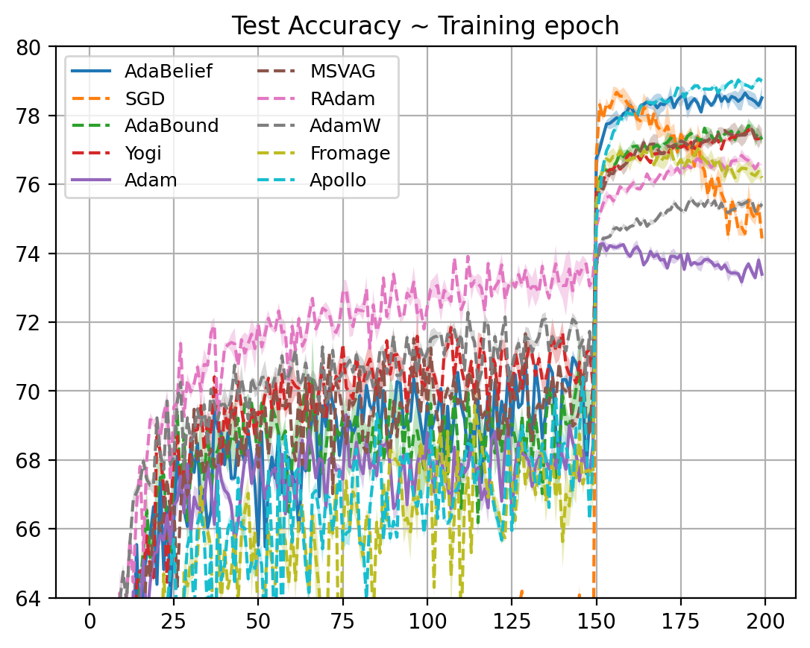

##  Steps to train Image classification on Cifar-100

###  Training the network
We train on CIFAR-100 using 3 architectures: VGG11, ResNet34, DenseNet121. To train the network run the command:

>python main.py --optim adabelief --lr 1e-3 --eps 1e-8 --beta1 0.9 --beta2 0.999 --momentum 0.9

The hyper-parameters for different optimizers and runtime for the experiments can be looked up from [root README.md](../README.md).

### Visualizing results
During training, data points for train and test accuracies are stored in the [curve](./curve) folder. To visualize train or test accuracies v/s epochs refer [visualization.ipynb](./visualization.ipynb) notebook.

### CIFAR-100 Test accuracies 

#### VGG11

#### ResNet34

#### DenseNet121

