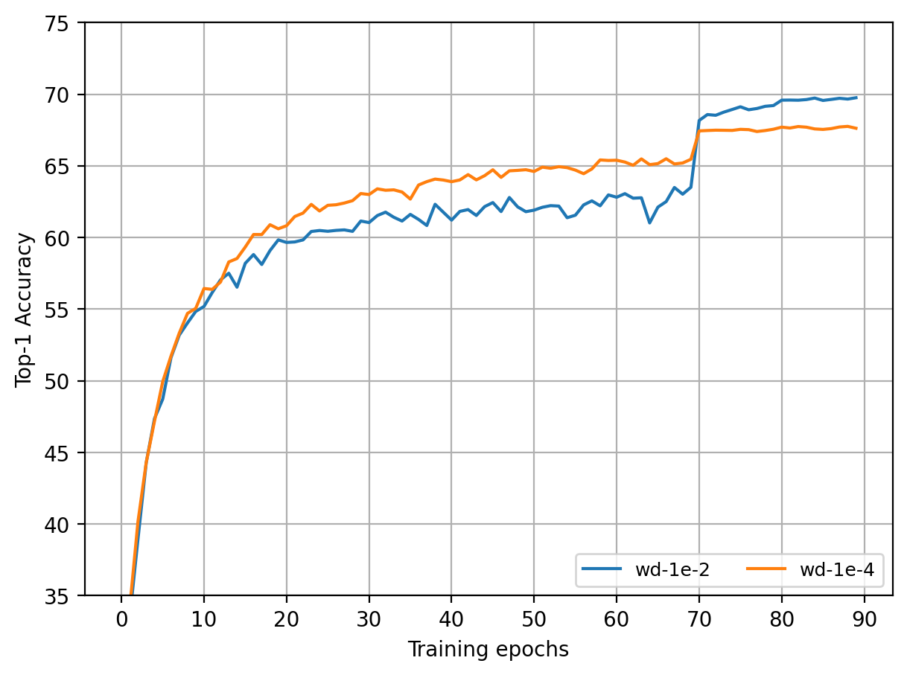

##  Steps to train ImageNet 

###  Training the network
We train ImageNet using a ResNet 18 architecture. To train the network, run the command:

>python main.py --data /path/to/ImageNet/dataset --optimizer adabelief --lr 1e-3 --wd 1e-2 --beta1 0.9 --beta2 0.999 --eps 1e-8 --weight_decouple True --batch-size 64 --arch resnet18 --when 70 80

- `when` parameter indicates when we want to decay the learning rate  (at which epoch),
- `weight_decouple` indicates if we want to use weight decouple. 
- The hyper-parameters for different optimizers and runtime for the experiments can be looked up from [root README.md](../README.md). 
- To use distributed training on ImageNet, refer [here](https://github.com/pytorch/examples/tree/master/imagenet).

### Weight Decay analysis on AdaBelief
We analyse the effect of varying weight decay by training ImageNet using `wd` as `1e-2` and `1e-4` and observe a ~2% Top-1 accuracy drop (from 69.76% to 67.76%) while using `wd` of `1e-2`.

#### Effect of varying weight decay
