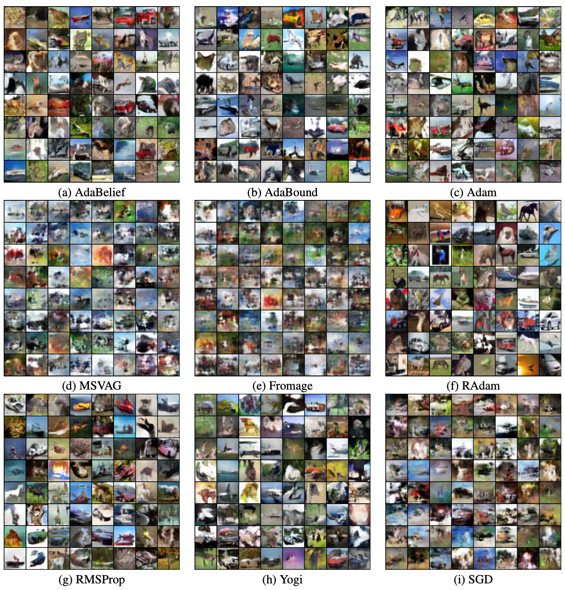

### Steps to train WGAN-GP

This folder contains code to train WGAN-GP on CIFAR-10 dataset.

### Command to run

>python main.py --optimizer adabelief --eps 1e-12 --Train --dataset cifar10 

The hyper-parameters for different optimizers and runtime for the experiments can be looked up from [root README.md](../README.md).
We train WGAN-GP using 9 different optimizers.

### Collage of generated images
